# Lab Report 1 - Week 2

* ## Installing VScode
    1. To check if my computer has java : type `javac --version`
    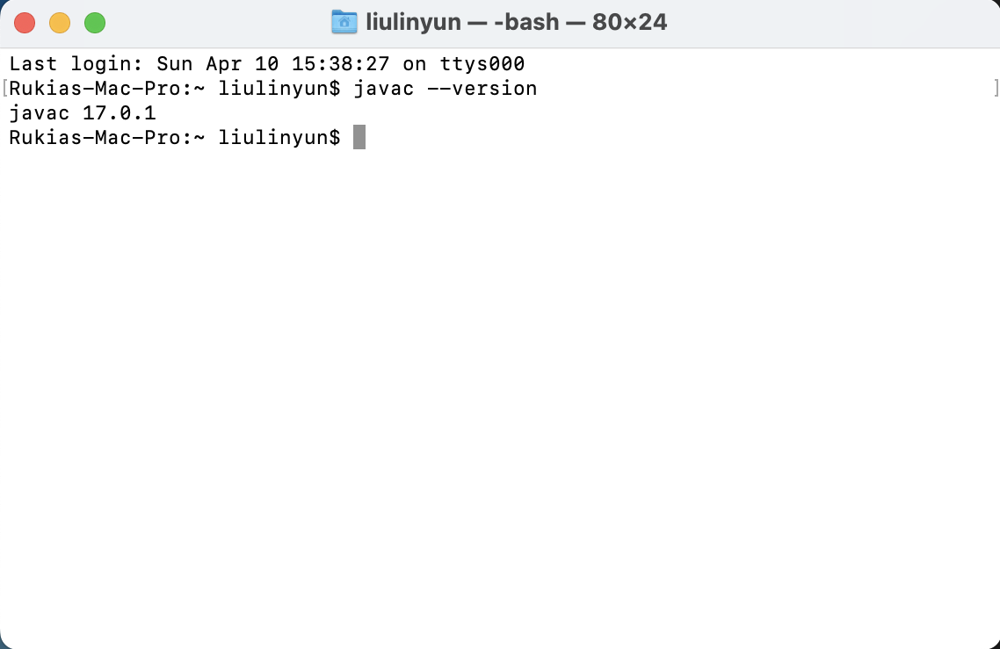
    Since I have the java installing in my computer, so I don't have to installe it again. **BUT** if you don't have one or the version is not higher than 13, please install the latest version of java.

    2. Download Visual Studio Code from this [Link](https://code.visualstudio.com/),and click the Download button at the top right corner.
    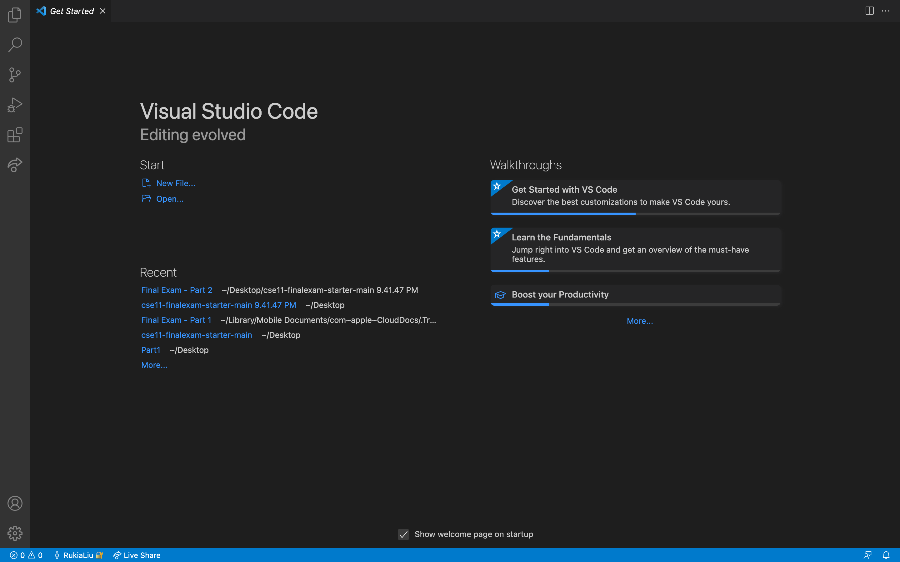
    This should be the page you see when you open vscode. Since I am a Mac user, I was facing a small problem when I was trying open VS Code. *"Visual Studio Code" can't be opened because it was not downloaded from the App Store."* To fix this, you should just go to System Preferences and *" Allow apps downloaded from:"* from App store to App store and identified developers.

* ## Remotely Connecting
    1. If you are on Windows, install the OpenSSH from the [Link](https://docs.microsoft.com/en-us/windows-server/administration/openssh/openssh_install_firstuse)
    2. Open a new terminal from the top left bar, and type `$ ssh cs15lsp22zz@ieng6.ucsd.edu`(Note: replace `zz` to the letters in class account. You can get it from [Link](https://sdacs.ucsd.edu/~icc/index.php)).
    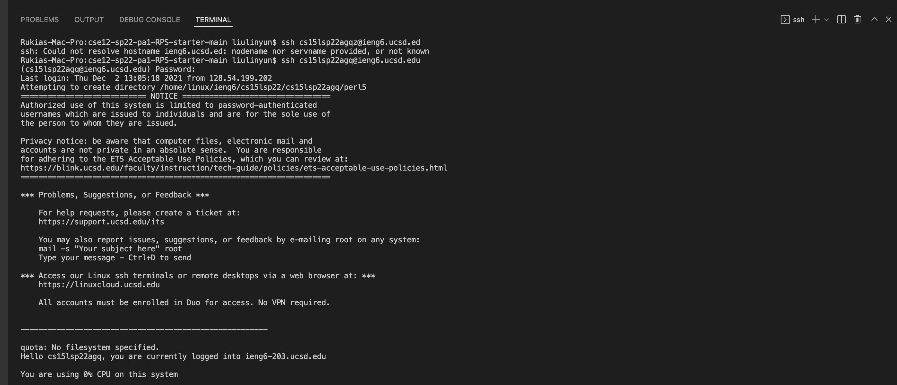
    Now my terminal is connedted to a computer in the CSE basement. I have not have any problem when I do this step, so you should be able to do that.

* ## Trying some Commands
    1. Running all thoese commands on the remote computer after ssh-ing
    `cd ~`
    `cd`
    `ls -lat`
    `ls -a`
    `ls <directory> ` where `<directory> `is `/home/linux/ieng6/cs15lsp22/cs15lsp22abc`
    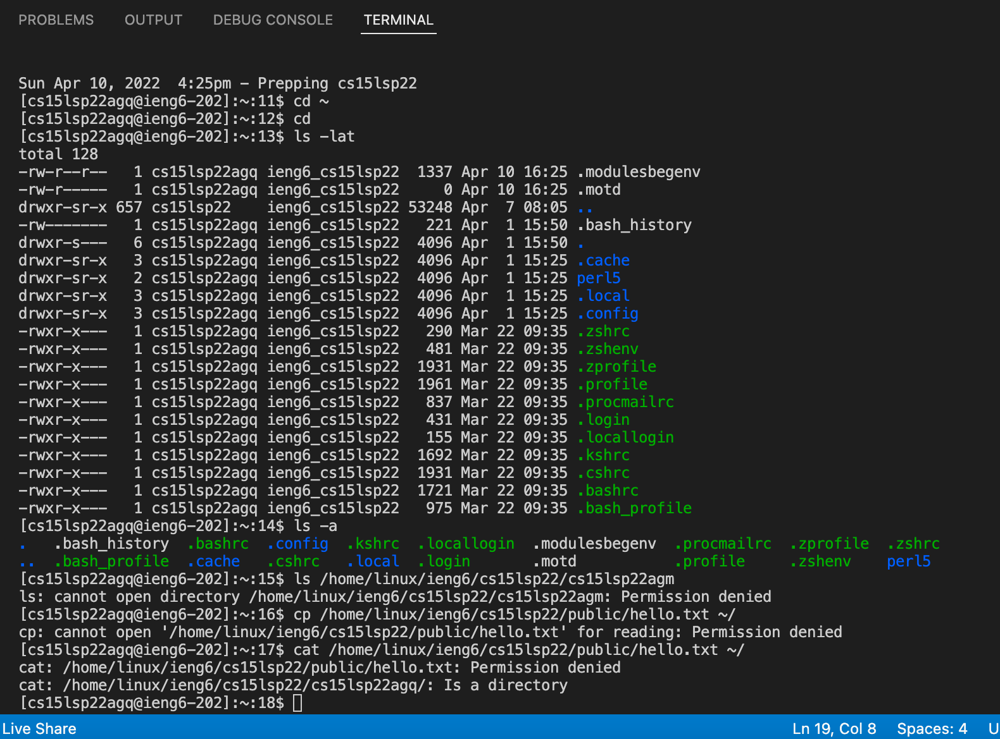
    2. Run the commmand `exit` to run thoese commands on my computer
    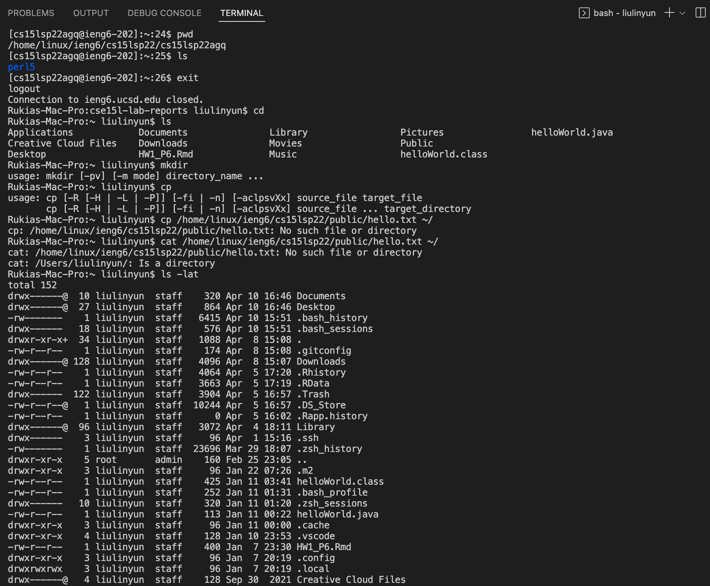
    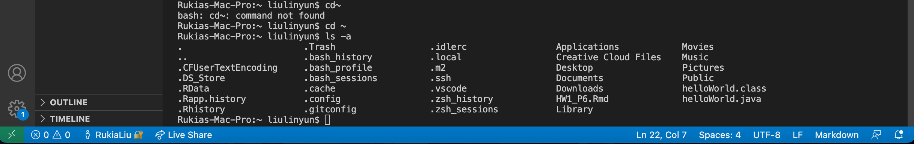
    * ls - list files and directories
    * cp - copy files
    * cat - concatenate files and show contents to the standard output
    * cd – change directory
    * pwd – confirm current directory
    * mkdir – make new directory

* ## Moving Files with `scp`
    1. Create a file on computer called `WhereAmI.java` and put contents into it. 
    ```
    class WhereAmI {
        public static void main(String[] args) {
            System.out.println(System.getProperty("os.name"));
            System.out.println(System.getProperty("user.name"));
            System.out.println(System.getProperty("user.home"));
            System.out.println(System.getProperty("user.dir"));
        }
    }
    ```
    And then run `javac` and `java`. This is what I got.
    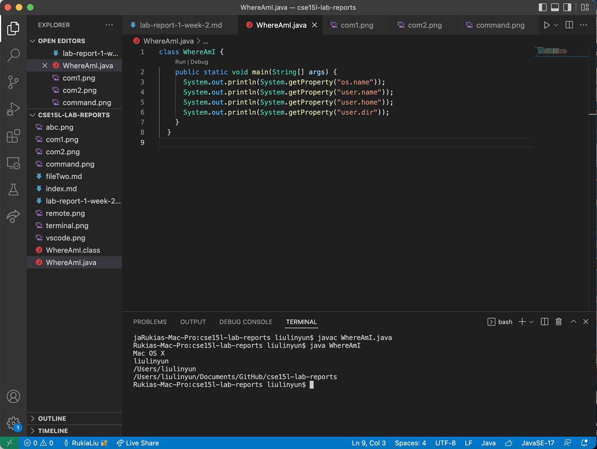
    2. Run the command `scp WhereAmI.java cs15lsp22zz@ieng6.ucsd.edu:~/` (replace zz to your account name) and enter the password. Then log into ieng6 with ssh again and ues `ls`. Now I can run `javac` and `java` on the ieng6 computer.
    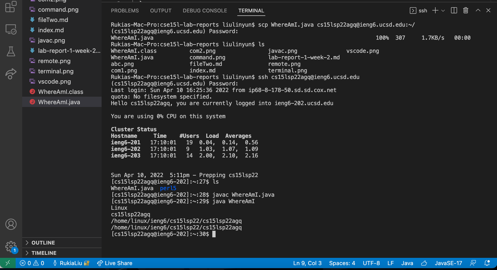
    
* ## Setting an SSH key
    1. get a new terminal, then type command `$ ssh-keygen`, then type ` / /Users/liulinyun/.ssh/id_rsa` and then type the password for logging in the ieng6. After all, we don't have to type password when we want to log in the `ssh` and `scp`.
    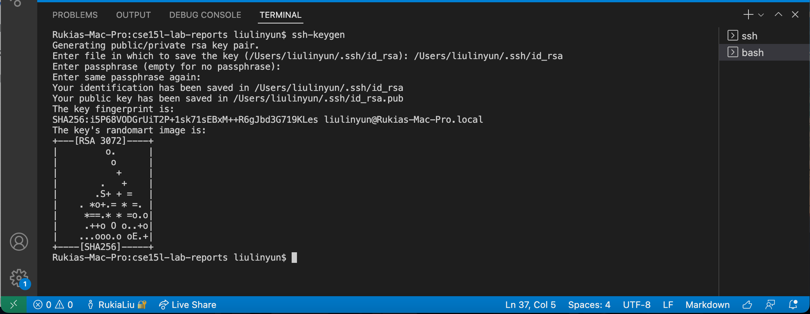
    2. Now cope the public key to the `.ssh` directory of your user account on the server:
    ```
    $ssh cs15lsp22agq@ieng6.ucsd.edu
    <Enter Password>
    $ mkdir .ssh
    <logout>
    scp /Users/liulinyun/.ssh/id_rsa.pub cs15lsp22aqg@ieng6.ucsd.edu:~/.ssh/authorized_keys
    ```
      
    3. Let verify it
      * verify if I am able to ssh from this client to the server without entering my password.
      
      **NO password needed**

* ## Optimizing Remote Running
    1. Run a command in quotes at the end of an ssh command to directly run it on the remote server
    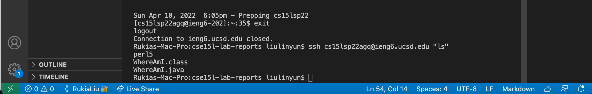
    2. Use semicolons to run multiple commands on the same line
    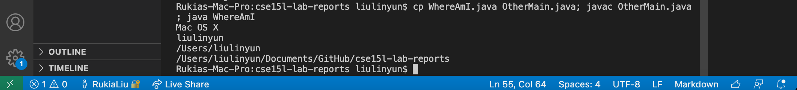
    3. Use up-arrow on keyboard to recall the last command
    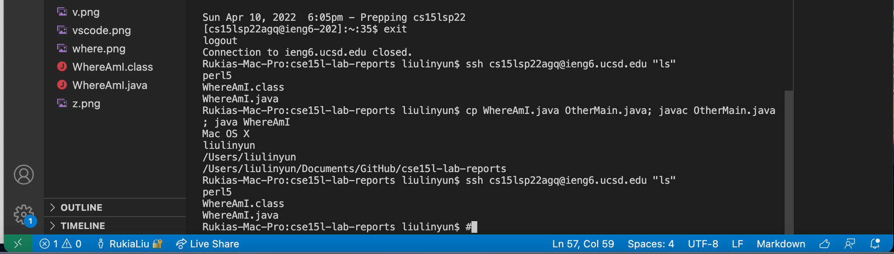
      


