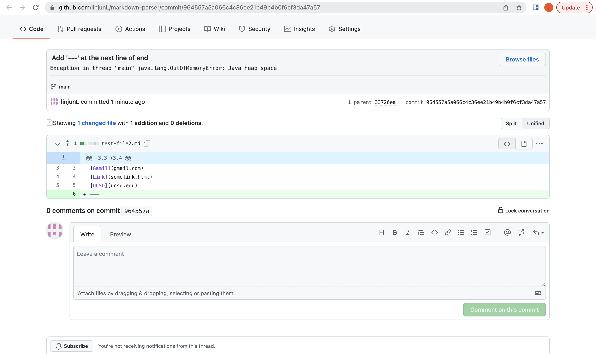
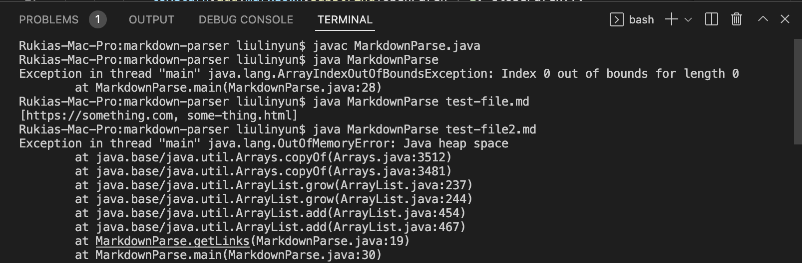
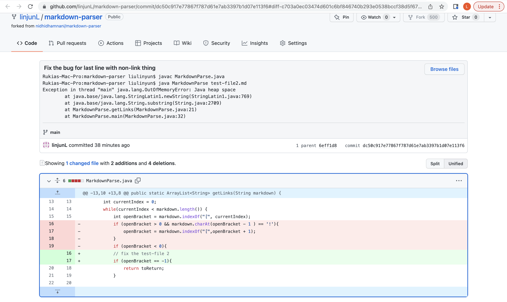
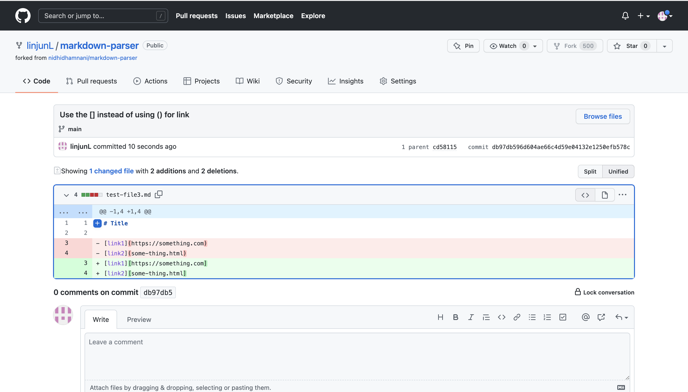
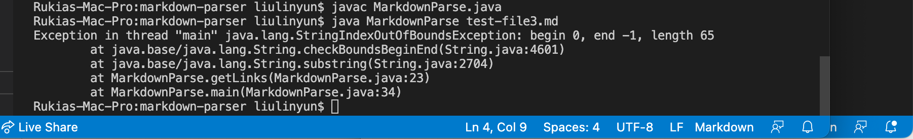
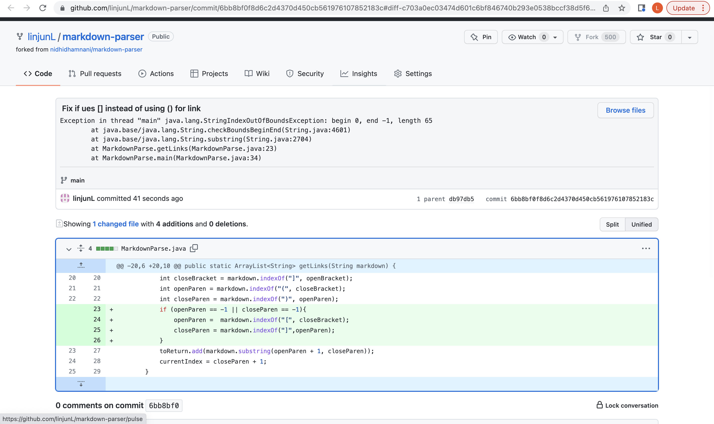
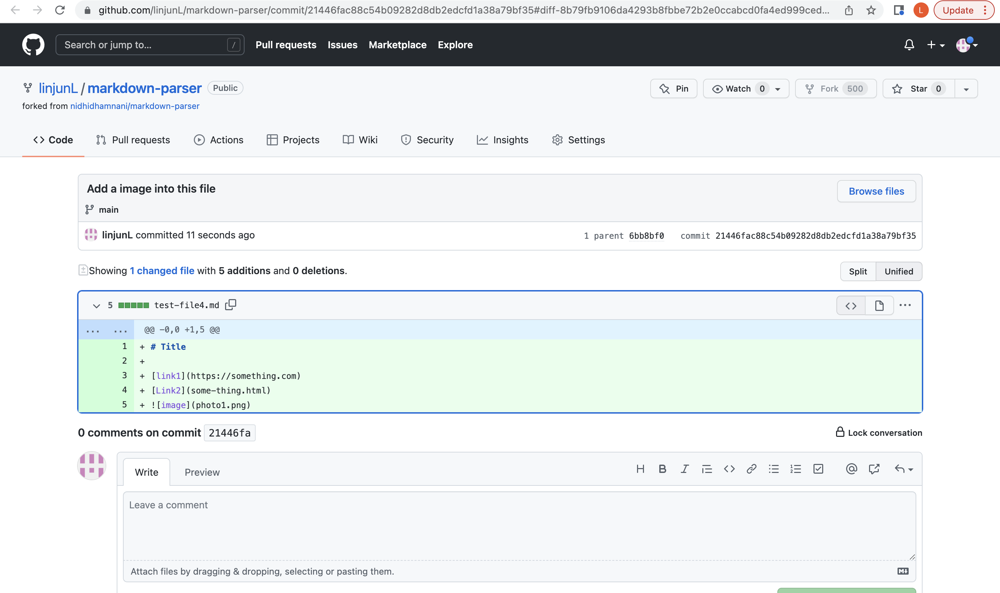
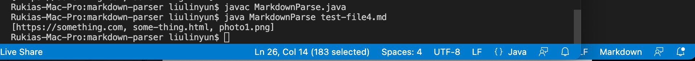
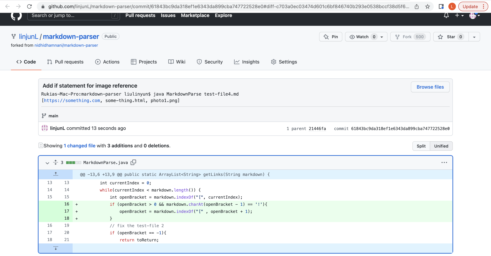

# Lab Report 2 - Week 4
## **Goal for this lab**: Pick three code changes that our group worked on in lab3 in order to fix a bug.

---
## 1. Code change one
* We recreated a test called test-file2.md, and added `---` to the last line of this file.
* ScreenShoot of the code change diff: 

* [Link](https://github.com/linjunL/markdown-parser/blob/main/test-file2.md) to the test file for a failure-including input
* Output of running the file at command line: 

 This is the soultion for code change 1
 
* Summary: The failure-including input is `---` but it's the same thing if something at the end of the link. So this will cause the currentIndex is actualy less than the markdown.length. But there is no more link here. When we start again for the last line with `---`. The openBracket can not be find in the next line. So there is a bug. 
The code :
```
if (openBracket == -1){
        return toReturn;
}
``` 
will help us the determinate if the next line still with a line or not.

---
## 2. Code change Two
* We re-created a test called test-file3.md again, and replaced all () in this test with [].
* ScreenShoot of the code change diff

* [Link](https://github.com/linjunL/markdown-parser/blob/main/test-file3.md) to the test file for a failure-including input.
* Output of running the file at the command line:

 This is the soultion for code changes 2 
 
 * Summary: The failure-including-input is `[]` for insteading `()` for link. Since when the code run, the openParen and closeParen will get value -1, this is a bug and cause error. So, we just need to write a if statment for checking if there is zero value for `indexOf("(") ` or `indexOf(")`  is -1. If so, just reassign the value to get the next `[` and `]` as the openParen and closeParen. The code I update is following: 
 ```
 if (openParen == -1 || closeParen == -1)
 {
    openParen =  markdown.indexOf("[", closeBracket);            closeParen = markdown.indexOf("]",openParen);
}
```

---
## 3. Code change 3
* We recreated a test called test-file4.md again, and added an imgae reference to this test file.
* Screenshot of the code change diff:

* [Link](https://github.com/linjunL/markdown-parser/blob/main/test-file4.md) to the test file for a failure-including input.
* Output of running the file at the command line:

 This is solution:
 
* Summary: The failure-including-input is the image reference. Since I don't want to the image in my link list, the output ` [https://something.com, some-thing.html, photo1.png]` with the image link is a bug. Let's check the code, the code just say fine the `indexOf` for `(` ,`)`, `[`, `]`. So the original code assume all reference to be link. So we have to update the code by adding if statement for image referenece at this monent. The code I update is following: 
```
if (openBracket > 0 && markdown.charAt(openBracket - 1) == '!')
{
    openBracket = markdown.indexOf("[" , openBracket + 1);
}
```


