# Lab Report 3 -- Week 6
## Lab goal: Implement all Group Choice Options(1-3) from Lab 5
**> Streamlining ssh Configuration**
1. Show your `.ssh/config` file, and how you edited it
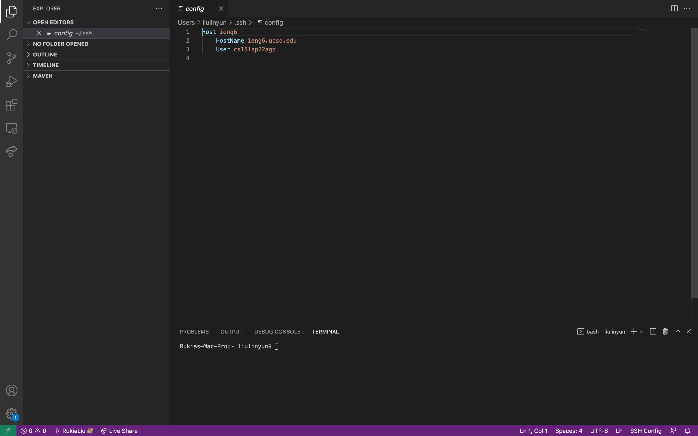
2. Show the `ssh` command logging you into your account using just the alias you chose.
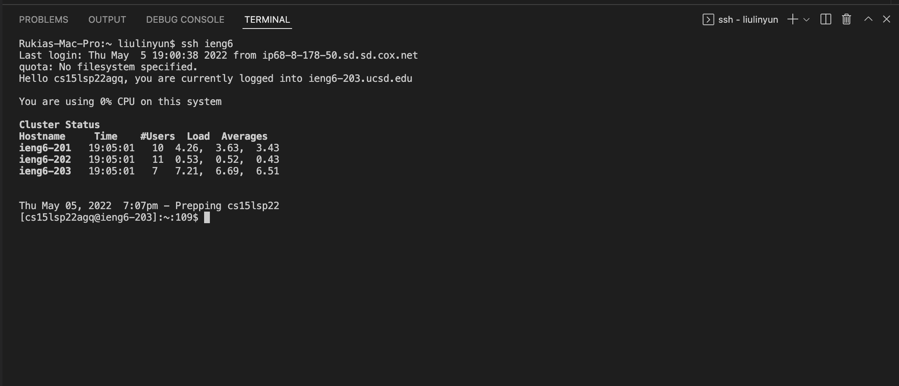
- I replaced `cs15lsp22agq@ieng6.ucsd.edu` with `ieng6`. It is really easy to type.
3. Show an `scp` command copying a file to your account using just the alias you chose.
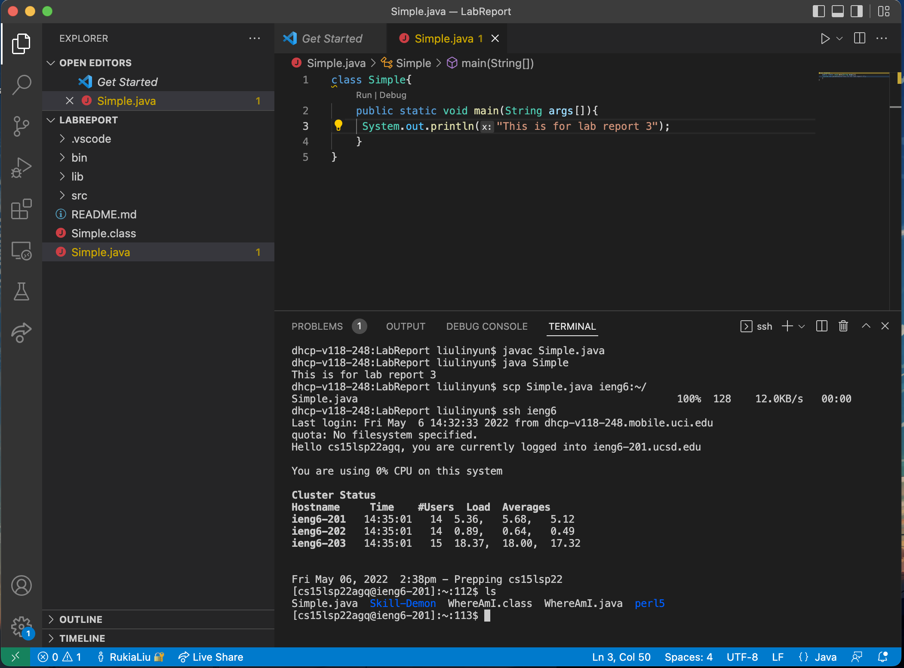
- I use `scp Simple.java ieng6:~/` to copy the file to my account and use `ls` to check if there is a file named 'Simple.java' here.

**> Set Github Access from ieng6**
1. Show where the public key you made is stored on Github and in your user account.
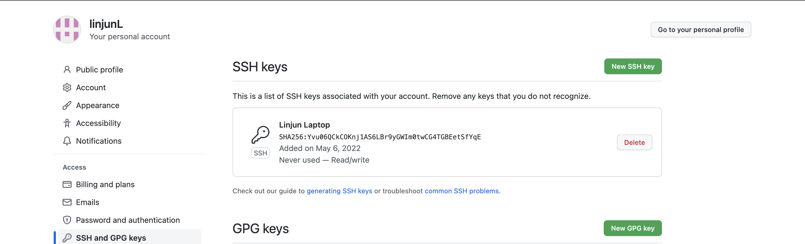
- Use this [tutorial](https://docs.github.com/en/authentication/connecting-to-github-with-ssh/adding-a-new-ssh-key-to-your-github-account) to add the public key you made as part of the remote access lab to Github.
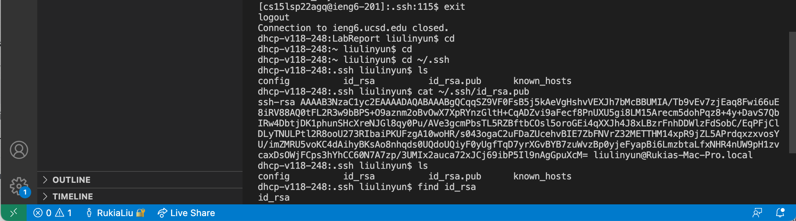
- This is where my public key stored in my computer.
2. Show where the private key you made is stored on your user account (but not its contents) as a screenshot.
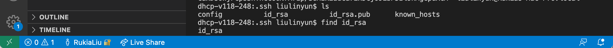
3. Show running git commands to commit and push a change to Github while logged into your ieng6 account.
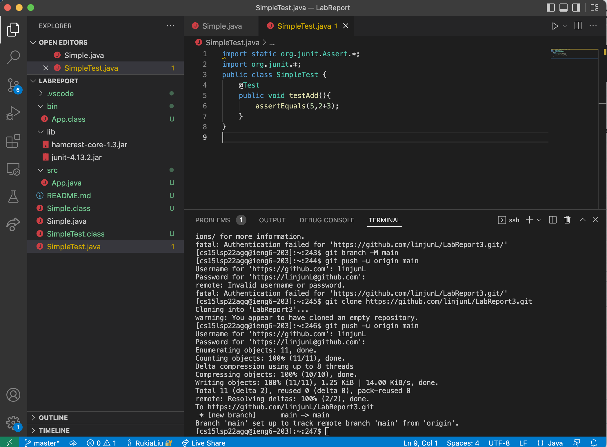
- First, we need to add a Personal access tokens from [here](https://github.com/settings/tokens).
- Second, we need to use a token on the command line.
```
$ git clone https://github.com/username/repo.git
Username: your_username
Password: your_token
```
- create a new repository on the command line
```
echo "# name of repo" >> README.md
git init
git add README.md
git commit -m "first commit"
git branch -M main
git remote add origin https://github.com/linjunL/123.git
git push -u origin main
```
- push an existing repository from the command line
```
git remote add origin https://github.com/linjunL/repo.git
git branch -M main
git push -u origin main
```
4. Show a link for the resulting commit.
- This is my [Link](https://github.com/linjunL/LabRhttps://github.com/linjunL/LabReport3/blob/main/SimpleTest.javaeport3/blob/main/SimpleTest.java) for the resulting commit "initial commit with java files".

**> Copy whole directories with `scp -r`**
1. Show copying your whole markdown-parse directory to your ieng6 account.
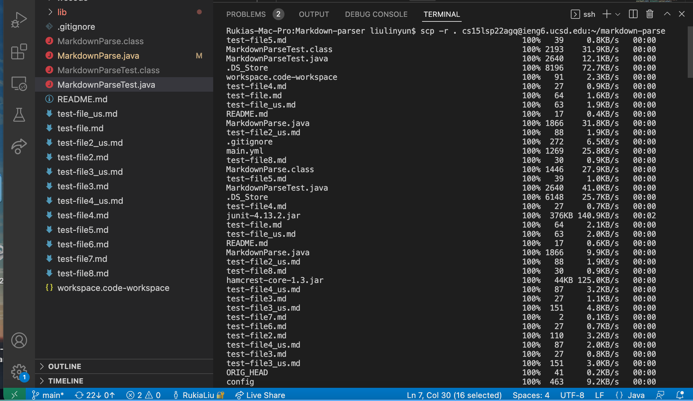
- Let's check it if the whole directory in my ieng6 account by `ls`.
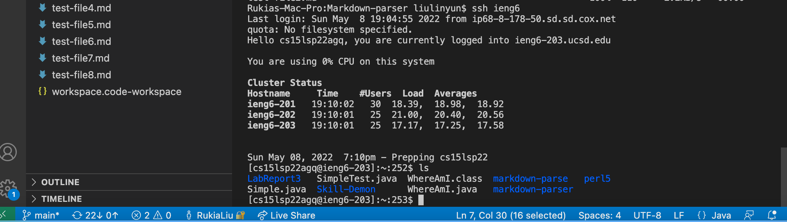
2. Show logging into your ieng6 account after doing this and compiling and running the tests for your repository.
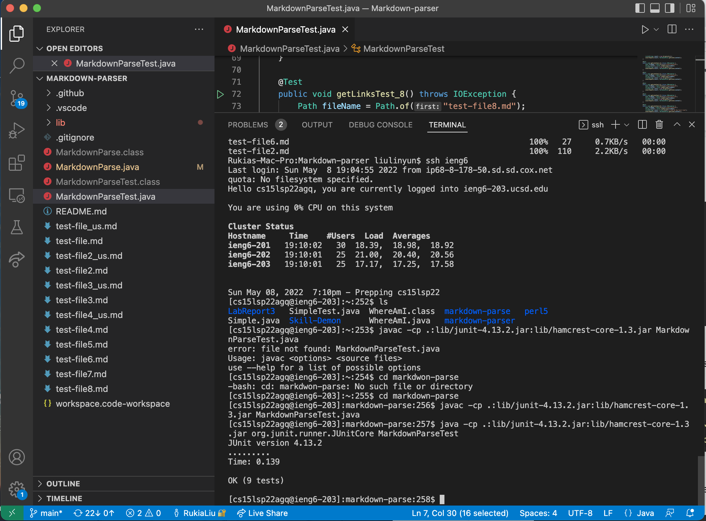
- `scp` to copy this directory
- `.` to represented by this directory
- `-r` option tells `scp` to work recursively .
3. Show (like in the last step of the first lab) combining scp, ;, and ssh to copy the whole directory and run the tests in one line.
- We can combine multiple commands in same line by useing `;` to run them  in most terminal.
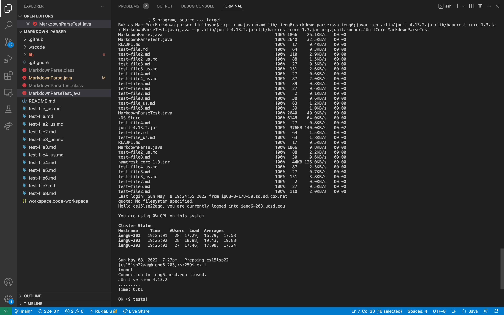


