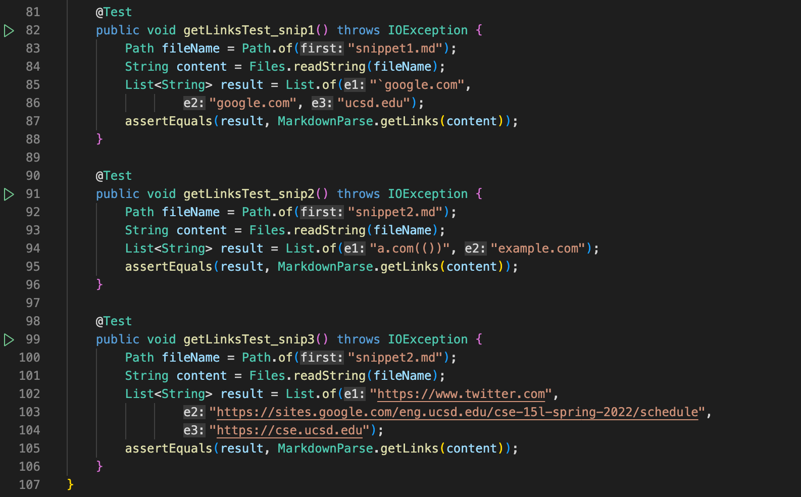
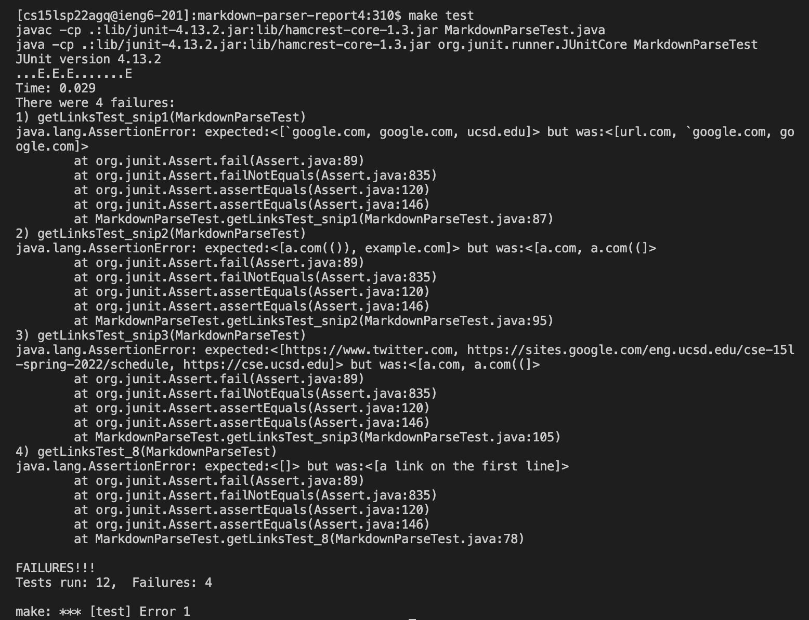
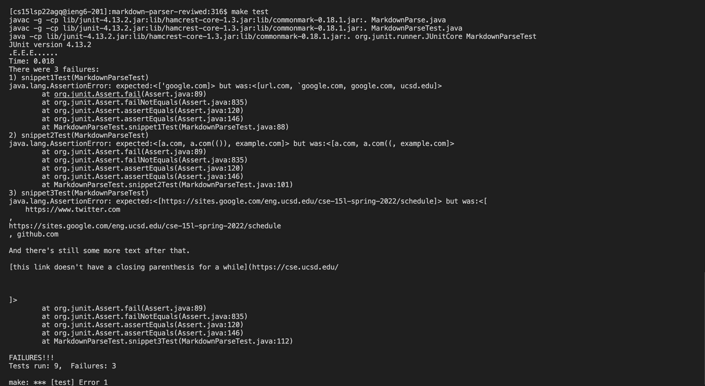

# Lab Report 4 - Week 8
> Lab goal: For each snippet, add a test both on my group implementation of markdown-parse, and the implementation my gourp reviewed in week 7. Run the test and show the results of running the tests on each.
---
* ## A link to our group markdown-parse repository and a link to the one our group reviewed in week 7
> Our group[markdown-parse](https://github.com/katieki/markdown-parser) repository

> Other group [markdown-parse](https://github.com/henrigy/markdown-parser/blob/main/MarkdownParse.java) repository to be reviewed.

* ## For each test above:
1. **Decide on what it should be produce:**
**Snippet 1**
```
[`google.com, google.com, ucsd.edu]
```
**Snippet 2**
```
[a.com(()), example.com]
```
***Snippet 3**
```
[https://www.twitter.com, https://sites.google.com/eng.ucsd.edu/cse-15l-spring-2022/schedule, https://cse.ucsd.edu]
```
2. **Showing the code in `MarkdownParseTest.java` for how my turned it into a test:**

3. **The output when running the tests on my group's implementation**

All 3 snippts are failed. The outputs were not correct but no errors were thrown.
  1. Snippet 1: 
  *Expect*: 
  ```
  [`google.com, google.com, ucsd.edu]
  ```
  *My output:*
  ```
  [url.com, `google.com, google.com]
  ```
  2. Snippet 2:
  *Expect*: 
  ```
  [a.com(()), example.com]
  ```
  *My output:*
  ```
  [a.com, a.com((]
  ```
  3. Snippet 3:
  *Expect*: 
  ```
  [https://www.twitter.com, https://sites.google.com/eng.ucsd.edu/cse-15l-spring-2022/schedule, https://cse.ucsd.edu]
  ```
  *My output:*
  ```
  [a.com, a.com((]
  ```
  4. **The output when running the tests on reviewed group's implementation**
  
  All 3 snippts are failed. The outputs were not correct but no errors were thrown.
  1. Snippet 1: 
  *Their output:*
  ```
  [url.com, `google.com, google.com, ucsd.edu]
  ```
  2. Snippet 2:
  *Their output:*
  ```
  [a.com, a.com((, example.com]
  ```
  3. Snippet 3:
  *Their output:*
  ```
  [
    https://www.twitter.com
, 
https://sites.google.com/eng.ucsd.edu/cse-15l-spring-2022/schedule
, github.com
And there's still some more text after that.
[this link doesn't have a closing parenthesis for a while](https://cse.ucsd.edu/
]
  ```

* ## Answer Questions:
>A: I don't think there is a small code change that will make my program work for snippet 1. If we resolve the backticks in the first link, it will affect the prints of subsequent links.

>A:I think it's a little hard to make your program work for Snippet 2 and all the related cases of nested parentheses, parentheses, and escaped parentheses with a small code change. But we can still write a helper method to solve this problem.

>A: I do think there is a small code change that will make your program work for snippet 3 and all related cases that have newlines in brackets and parentheses. We just need to write a helper method to remove spaces and newlines in links to solve this problem.


