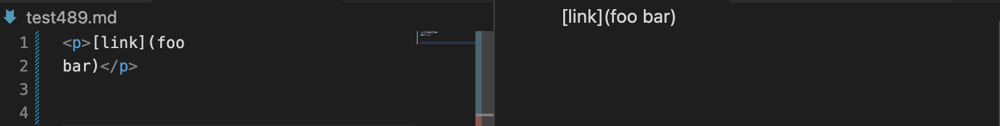

# Lab Report 5 - Week 10
> Lab Goal: Choose any **TWO** tests from the 625 tests where I implementation has different answers that the implementation we provided for lab 9.

## Tasks:
 >How I found the tests with different results?

- For both of the different answers, I use **`vimdiff`** on the results of running a bash for loop.

>Provide a link to the test-file with TWO different-results

- This is my [first test-file link](https://github.com/nidhidhamnani/markdown-parser/blob/main/test-files/510.html.test) (tests-file 510.md)
- This is my [second test-file link](https://github.com/nidhidhamnani/markdown-parser/blob/main/test-files/489.html.test)(test-files/489.md)

>Describe which implementation is correct, or neither if both give the wrong output 

1. **BUG 1**: The **provided** implementation is correct.
2. **BUG 2**: **BOTH** give the wrong output.

>Indicated both actual outputs and also what the expected output is.

1. **BUG 1:** 
- Actual Output

- Expected output is `[/uri]`.

2.**BUG 2:**
- Actual Output

- Expected output is `[foo bar]`.

>Describe the bug and the code needs to be changed
1. Bug 1:
- 
- The hight part is the bug, since the test 510 is `
[link] (/uri)
`. There is a space betewwn the closeBracket `]` and the openParen `(`, which means that openParen != closeBracket + 1. So the code will skip this if statement, then juest go `toReturn` which is just empty ArrayList[].
- **Output after debugging**

- **Changes** of code

2. BUG 2:
- 
- For this bug, I am not fix it.
- This high light part is the bug, since the test 489 is `
[link](foo`

    `bar)
`. There is a new line between the foo and bar. So if the code go throgh the high light part will directly show what is look like which case the erro. If I want to fix this bug, I need to write a helper method that get the index for the new line by `link.charAt(index) == '\n'`. After that, we can use for loop to rewrite the foo bar without the new line and replace the new line with a space.

